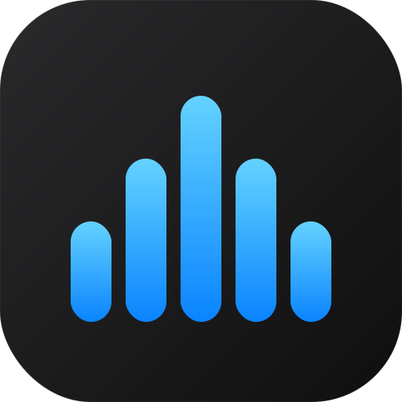

# nasTune

A self-hosted web UI for managing iPod Classic, iPod 5th generation, and Sony WALKMAN devices from a headless NAS. Runs as a Docker container; access it from any browser on your local network — no iTunes, no display required.

iPod support is built around [gpod-utils](https://github.com/d3vil-st/gpod-utils), which wraps libgpod for reading and writing the iPod's iTunesDB format. WALKMAN devices are detected via `default-capability.xml` and managed with direct file operations.

---

## Screenshots

<table>
  <tr>
    <td></td>
    <td></td>
  </tr>
  <tr>
    <td></td>
    <td></td>
  </tr>
</table>

---

## Features

- **Browse** your iPod or WALKMAN library in a 3-pane iTunes-style view (artists → albums → tracks)
- **All Artists** — select the top row in the artist column to browse all albums across every artist in a single flat view
- **Sony WALKMAN support** — detected automatically via `default-capability.xml`; tag-based scan (mutagen) indexes the device into SQLite; delete and sync use direct file operations with immediate DB update — no rescan needed
- **Force full rescan** — WALKMAN devices and NAS sources each have a full-rescan button that clears all existing library data and re-reads every file from scratch; useful after tag corrections or large file moves (confirmation dialog shown before starting)
- **Sync** tracks from a NAS music source to the device — add missing tracks, remove ones no longer in the source; sync confirmation dialog appears when deletes are involved or free space is insufficient
- **Source comparison** — tracks in the iPod/WALKMAN pane appear in blue when they are absent from the selected NAS source; parent album and artist rows turn blue as soon as even a single track is missing
- **Unsynced filter** — one-click toggle in the Sources bar to show only tracks not yet on the device; state saved per browser
- **Delete** selected tracks from the device
- **Download** selected tracks as a `.tar` archive with restored directory structure (`Artist/[Year] - Album/NN - Title.ext`)
- **Play** tracks directly in the browser (iPod/WALKMAN and NAS source), with ALAC→FLAC transcoding on the fly for Firefox compatibility
- **Compare** device contents against your NAS library — checkboxes show what's already synced
- **Storage bar** — shows used / net change / free with a live delete/add counter overlay during operations
- **Operation log** — click the status bar progress indicator to view live output in a terminal popup; last operation result and log persist across page reloads
- **Multi-disc album** support with CD separators and disc-aware track matching
- **Search** with smart navigation — click an artist from results to see all their albums (when the artist name matched) or only relevant albums (when an album or track matched); clear button in the search field
- **Auto-discover** connected devices via USB polling; optional auto-mount
- **Light / Dark / Auto** theme with system preference detection
- **Mobile-friendly** responsive 3-pane layout that collapses to a single-pane slide view on small screens
- **URL state** — navigation (tab, artist, album, device) is encoded in the hash so reloads and bookmarks work
- **Build version** displayed in the right end of the status bar (tag + short SHA + `-dirty` suffix for uncommitted local builds)

---

## Requirements

- Docker + Docker Compose
- iPod Classic (1st–6th gen), iPod 5th generation (Video), or Sony WALKMAN (NWZ/NW series with `default-capability.xml`)
- USB connection to the NAS host
- NAS music library mounted at a known path (optional, for sync)

---

## Quick start

```bash
git clone https://github.com/d3vil-st/nasTune.git
cd nasTune
docker compose up --build
```

Open `http://<nas-ip>:8080` in your browser. Connect an iPod via USB — it will be detected automatically if already mounted by the host, or auto-mounted if `IPOD_AUTOMOUNT=1` is set.

The default `docker-compose.yml` expects:
- NAS music at `/mnt/music` on the host (read-only)

Adjust volume paths to match your setup.

---

## Configuration

All configuration is done via environment variables in `docker-compose.yml`:

| Variable | Default | Description |
|---|---|---|
| `IPOD_MOUNT_POINT` | _(unset)_ | Path to a pre-mounted iPod directory. Use this if your host mounts the iPod itself and you just want nasTune to manage it. |
| `IPOD_MOUNT_BASE` | `/mnt/ipods` | Base directory for auto-mounted devices (one subdir per device). |
| `IPOD_AUTOMOUNT` | `0` | Set to `1` to auto-mount USB block devices detected by lsblk. Requires `privileged: true`. |
| `DB_PATH` | `/data/nastune.db` | SQLite database for the NAS source library index. |
| `GPOD_DRY_RUN` | `0` | Set to `1` to log all write commands without executing them. Safe for testing. |

---

## NAS source libraries

nasTune can index one or more directories of your NAS music collection and compare them against the iPod:

1. Click **Sources** in the header
2. Add a source by browsing to a directory (e.g. `/music`)
3. nasTune scans the directory with mutagen and indexes all audio files
4. Switch back to **Library** — tracks already on the iPod are pre-checked; unchecked tracks are candidates to sync

Supported formats: MP3, FLAC, AAC/M4A (including ALAC), AIFF, WAV, OGG.

---

## Sync behaviour

- **Sync** button appears when there are changes (tracks to add or remove)
- A confirmation dialog is shown automatically when the sync includes deletes or when the files to copy exceed available free space (accounting for space freed by deletes); the dialog shows a warning and offers "Sync anyway" for the space-insufficient case
- Tracks are matched by normalized `artist + album + track_nr` (or title if no track number), with disc number awareness for multi-disc albums
- **iPod**: when syncing a complete album or artist, the directory path is passed to `gpod-cp` rather than individual files — faster and avoids path-length issues; progress is tracked per-track from streaming output
- **WALKMAN**: sync uses `shutil.copy2` / `os.remove`; the SQLite library is updated immediately on completion without a rescan

---

## Download

Select tracks on the iPod and click **Download** to receive a `.tar` archive. The iPod stores files with obfuscated names (`:iPod_Control:Music:F02:TGWN.mp3`); nasTune restores the original structure:

```
Artist/
  [2024] - Album Name/
    01 - Track Title.mp3
    02 - Another Track.mp3
```

The archive is streamed directly from the iPod to your browser — no temporary files are written on the server.

---

## Architecture

| Layer | Technology |
|---|---|
| Backend | FastAPI + Uvicorn (Python 3.12) |
| Frontend | Alpine.js 3.15 (vendored) + Jinja2 templates + plain CSS |
| iPod I/O | gpod-utils CLI (libgpod wrapper) |
| WALKMAN I/O | shutil file operations + SQLite library cache |
| Tag reading | mutagen |
| Audio transcode | ffmpeg (ALAC→FLAC, streaming + seekable tmpfs cache) |
| Library index | SQLite + aiosqlite |
| Device discovery | lsblk polling every 3 s |

No Node.js. No build step. No bundler.

---

## Development

```bash
python3 -m venv .venv
source .venv/bin/activate
pip install -r requirements.txt

IPOD_MOUNT_POINT=/mnt/ipod uvicorn app.main:app --reload --port 8080
```

`gpod-ls` and `ffmpeg` must be on `PATH`. Without a connected iPod the app starts normally with an empty device list — the source library scanner works independently.

See [CLAUDE.md](CLAUDE.md) for full architecture documentation, API reference, and known constraints.

---

## Reverse proxy

nasTune works behind a reverse proxy (nginx, Caddy, Traefik) and is compatible with Authentik forward authentication.

Three endpoint groups need special treatment because they use long-lived SSE streams or large audio responses:

```nginx
location ~ ^/(devices/events|operations/events|audio|sources/audio) {
    proxy_pass http://nastune_backend;
    proxy_http_version 1.1;
    proxy_set_header Connection '';
    proxy_buffering off;
    proxy_cache off;
    proxy_read_timeout 3600s;
    gzip off;
}
```

- **`proxy_http_version 1.1`** — nginx defaults to HTTP/1.0 upstream; SSE requires 1.1 for chunked transfer or events arrive batched at connection close.
- **`proxy_set_header Connection ''`** — clears the `Connection: close` header that HTTP/1.0 adds.
- **`proxy_buffering off` + `gzip off`** — prevents nginx from buffering SSE output waiting to fill a buffer or compress it, which kills real-time delivery.
- **`proxy_read_timeout 3600s`** — SSE connections are idle between events; the default 60 s timeout would close them.

If your global config includes an Authentik `include` directive, add it to this location block too so the streaming endpoints remain protected.

---

## License

MIT
